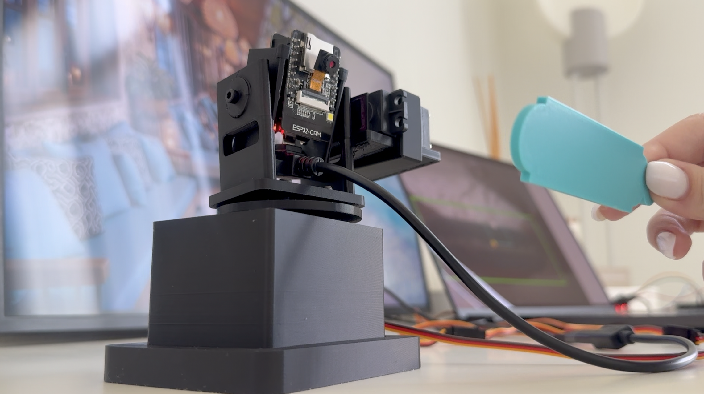
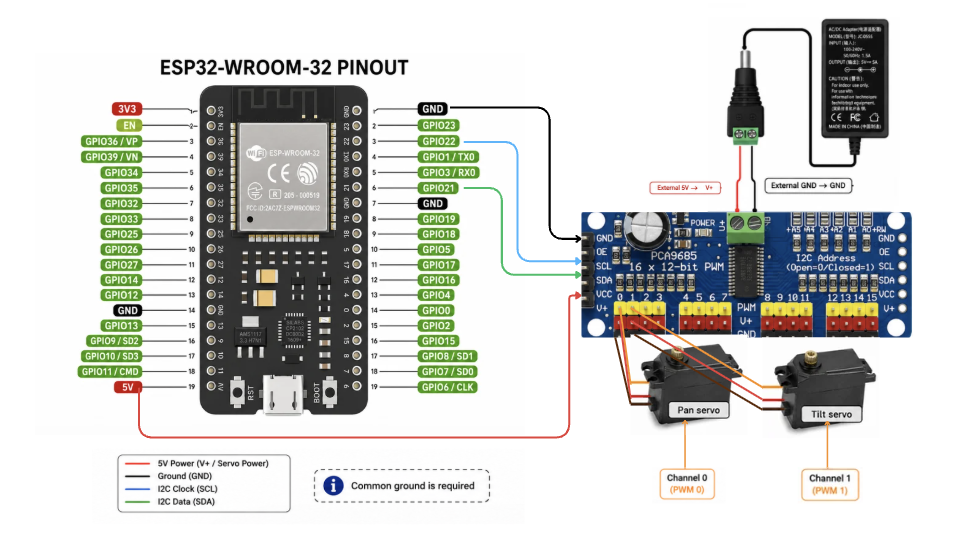

# ESP32-CAM AI Object Tracking Camera

This project is a prototype AI object-tracking camera built with an ESP32-CAM, a second ESP32, a PCA9685 servo driver, two MG995/MG996-style servos, a custom YOLO model, and 3D-printed mechanical parts.

The ESP32-CAM streams live video to my laptop over Wi-Fi. Python runs a trained YOLO model to detect my custom 3D-printed target object. Then Python sends movement commands to a second ESP32, which controls the pan and tilt servos through the PCA9685 servo driver.

The goal of this project was to connect AI object detection with real hardware movement and design my own mechanical parts instead of using a ready-made pan-tilt mount.

## Demo

Project photo:



## How It Works

```text
ESP32-CAM
   ↓ Wi-Fi video stream
Laptop running Python + YOLO
   ↓ serial movement command
Second ESP32
   ↓ I2C
PCA9685 servo driver
   ↓
Pan and tilt servos
   ↓
Camera follows the object
```

## Hardware

* ESP32-CAM
* ESP32-WROOM-32 DevKit board
* PCA9685 16-channel servo driver
* 2 MG995/MG996-style servos
* External 5V power supply for the servos
* Jumper wires
* M3 screws
* Micro screws for the ESP32-CAM module
* 3D-printed camera mount parts

## Wiring

Basic wiring:

* ESP32 GPIO21 → PCA9685 SDA
* ESP32 GPIO22 → PCA9685 SCL
* ESP32 5V → PCA9685 VCC
* ESP32 GND → PCA9685 GND
* External 5V → PCA9685 V+
* External power GND → PCA9685 GND
* Pan servo → PCA9685 channel 0
* Tilt servo → PCA9685 channel 1

The PCA9685 uses I2C communication. SDA is the data line, and SCL is the clock line.

The servos are powered with external 5V power because servos need more current than the ESP32 should provide directly.

See wiring diagram:



## 3D Printed Parts

The STL files are in the `stl/` folder.

The OpenSCAD source file is in the `openscad/` folder, so the design can be adjusted for different hardware.

This design was made for my specific prototype, so dimensions may need to be adjusted depending on your servo, camera board, screws, and printer tolerances.

## AI Model

I trained a custom YOLO model using my own images of a 3D-printed target object.

The trained model file is:

```text
models/best.pt
```

## Python Setup

Install the Python dependencies:

```bash
pip install -r requirements.txt
```

Update these values in `python/ai_tracking.py` for your own setup:

```python
MODEL_PATH = "../models/best.pt"
SERIAL_PORT = "YOUR_SERIAL_PORT"
CAMERA_URL = "http://YOUR_ESP32_CAM_IP:81/stream"
```

Run the main tracking script:

```bash
cd python
python3 ai_tracking.py
```

## Arduino Setup

Upload the ESP32-CAM streaming code to the ESP32-CAM:

```text
arduino/esp32_cam_stream/esp32_cam_stream.ino
```

Upload the servo controller code to the second ESP32:

```text
arduino/servo_controller/servo_controller.ino
```

Before uploading the ESP32-CAM code, replace the Wi-Fi placeholders with your own Wi-Fi name and password.

## Project Files

```text
python/
  capture_images.py
  prepare_dataset.py
  ai_tracking.py

arduino/
  esp32_cam_stream/
  servo_controller/

stl/
  3D-printable parts

openscad/
  editable OpenSCAD source

docs/
  wiring diagram and notes

models/
  trained YOLO model
```
## Testing

I also included a testing checklist for the full prototype behavior, including startup, tracking, lost-target behavior, servo movement, latency, edge limits, long-run stability, and thermal checks.

See: [Testing Checklist](docs/testing.md)

## Notes

This is still a prototype. The movement, wiring, 3D-printed parts, and code are still being improved.

For real-time tracking, a smaller and faster video stream worked better than a high-resolution stream with too much delay.

## License

This project is shared for learning and experimentation.
